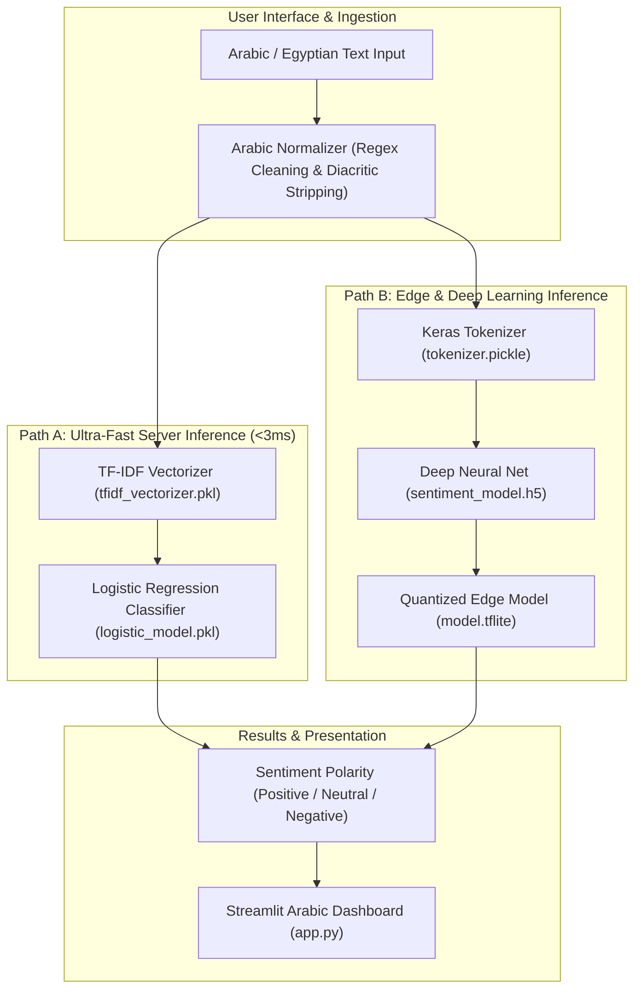

<br/><br/>

<!-- Animated Title -->
<p align="center">
  <a href="#">
    
  </a>
</p>

<p align="center">
  <b>Dual-Architecture Machine Learning & Deep Learning Engine for Arabic & Egyptian Dialect Sentiment Analysis</b><br/>
  <i>TF-IDF Feature Space · High-Precision Logistic Regression · Keras Deep Neural Network · Quantized TFLite Edge Distribution · Interactive Streamlit Application</i>
</p>

<br/>

<!-- Badges Row 1: Core Technologies -->
<p align="center">
  
  
  
  
  
</p>

<!-- Badges Row 2: NLP & Deployment -->
<p align="center">
  
  
  
  
  
</p>

<br/>

<!-- Quick Navigation Bar -->
<p align="center">
  <a href="#-overview"></a>
  &nbsp;
  <a href="#-problem-statement--solution"></a>
  &nbsp;
  <a href="#-sentiment-classes"></a>
  &nbsp;
  <a href="#%EF%B8%8F-dual-model-architecture"></a>
  &nbsp;
  <a href="#-machine-learning--deep-learning-pipeline"></a>
  &nbsp;
  <a href="#-quickstart--execution"></a>
</p>

---

## 📌 Overview

**Arabic Sentiment Analysis** is a production-grade NLP platform engineered to decode sentiment polarity across both **Modern Standard Arabic (MSA)** and **colloquial Egyptian dialect**. Because Egyptian Arabic is characterized by idiomatic phrasing, slang, negation particles (e.g. *مش*, *ما...ش*), and informal social media spelling, standard models frequently misinterpret context.

This repository implements a **dual-model machine learning architecture**:
1. **Ultra-Low Latency Statistical Baseline**: High-dimensional **TF-IDF vectorizer** paired with a calibrated **Logistic Regression model** (`logistic_model.pkl`), delivering $<3\text{ms}$ CPU inference in production web applications.
2. **Deep Learning & Edge Quantization**: A sequential **Keras deep neural network** (`sentiment_model.h5`) compiled and quantized into **TensorFlow Lite (`model.tflite`)**, enabling embedded deployment on mobile devices and edge gateways without server roundtrips.

```
                    ┌────────────────────────────────────────────────────────┐
                    │            Arabic Sentiment Pipeline                   │
                    │                                                        │
[ Arabic Review / ]─┼──> [ Text Normalizer (Arabic RegEx) ]                  ├──> [ Sentiment Verdict ]
[ Social Post     ] │             │                                          │    - 😡 Negative (Class 0)
                    │             ▼                                          │    - 😐 Neutral  (Class 1)
                    │    [ Feature Representation ]                          │    - 😊 Positive (Class 2)
                    │       ├── TF-IDF Vectorizer ──> Logistic Regression    │    - Confidence Score
                    │       └── Keras Tokenizer   ──> TFLite Deep Network    │
                    └────────────────────────────────────────────────────────┘
```

---

## 🎯 Problem Statement & Solution

<table>
<tr>
<td width="50%" valign="top">

### ❌ The Arabic Sentiment Dilemma

Analyzing Arabic sentiment poses severe linguistic challenges:

- 🗣️ **Colloquial Dialect Nuances**: Egyptian slang (*زي الفل*, *تحفة*, *طحن*, *وحش جداً*) defies formal MSA lexicons.
- 🔤 **Orthographic Inconsistencies**: Missing dots on Taa Marbuta ($ة \leftrightarrow ه$) and varying Alef forms ($أ, إ, آ \leftrightarrow ا$).
- 🚫 **Complex Negation Logic**: Enclitic negation structures (*مكنتش عارف*, *مفيش فايدة*) flip sentiment completely.
- 📱 **Mobile & Edge Latency**: Cloud-only deep learning models introduce network latency and prohibitive hosting costs.

</td>
<td width="50%" valign="top">

### ✅ The Architectural Solution

| Challenge | Applied Engineering Solution |
| :--- | :--- |
| **Dialect Calibration** | Trained on the **Egyptian Reviews Dataset** capturing authentic social consumer reviews. |
| **Normalization** | Unified Arabic regex preprocessing normalizing Alef, Yaa, and special characters. |
| **Dual Runtimes** | **Logistic Regression** for high-throughput server APIs; **Keras H5 / TFLite** for edge inference. |
| **Edge Portability** | Compressed **TensorFlow Lite binary** (`model.tflite`) running offline on Android/iOS/IoT. |
| **Interactive Studio** | **Streamlit** Arabic RTL web application for instant live sentence testing. |

</td>
</tr>
</table>

---

## 🔥 Sentiment Classes

The model classifies text into three calibrated sentiment tiers:

| Class Code | Polarity | Emoji Indicator | Dialectal Examples |
| :---: | :--- | :---: | :--- |
| **`0`** | **Negative** | 😡 | *"المنتج وحش جدا ومفيش خدمة عملاء"*, *"تجربة سيئة ومضيعة للوقت"* |
| **`1`** | **Neutral** | 😐 | *"الموضوع عادي خالص ومفيش جديد"*, *"المنتج وصل في ميعاده وبس"* |
| **`2`** | **Positive** | 😊 | *"الفيلم كان رائع جدا وممتع"*, *"خدمة ممتازة وتوصيل سريع عاش بجد"* |

---

## 🏗️ Dual-Model Architecture



---

## 🔬 Machine Learning & Deep Learning Pipeline

### 1. Statistical Pipeline (Scikit-Learn)
- **N-gram Range**: Unigram and bigram representation ($1, 2$) capturing compound phrases (e.g. *"مش حلو"*).
- **Term Weighting**: Sublinear TF scaling reducing the impact of outlier word frequencies.
- **Classifier**: Multi-Class Logistic Regression with L2 regularization and calibrated class balancing.

### 2. Deep Learning Pipeline (Keras & TFLite)
- **Embedding Layer**: Dense learned word representations capturing contextual semantic affinity.
- **Sequence Modeling**: Multi-layer neural network with Dropout regularization to prevent overfitting on slang.
- **Quantization**: Converted via `tf.lite.TFLiteConverter` with default optimizations, reducing model size to $\sim 2.5\text{MB}$ for instantaneous on-device evaluation.

---

## ⚙️ Technical Stack

| Component | Technology | Purpose & Implementation |
| :--- | :--- | :--- |
| **Classical ML** | **Scikit-Learn** | TF-IDF Vectorizer & Logistic Regression multi-class model |
| **Deep Learning** | **TensorFlow & Keras** | Sequential neural network architecture saved in `.h5` format |
| **Edge Optimization** | **TensorFlow Lite** | Compressed, hardware-accelerated mobile runtime (`.tflite`) |
| **Interactive UI** | **Streamlit** | Arabic RTL web application for immediate verification |
| **Serialization** | **Pickle & Joblib** | Fast loading of trained vectorizers and scikit-learn models |
| **Dataset** | **Egyptian Reviews Corpus** | Authentic crowd-sourced Egyptian consumer and social reviews |

---

## 📁 Repository Structure

```
Arabic-Sentiment-Analysis/
├── 📄 app.py                           # Interactive Streamlit Arabic web application
├── 📄 arabic-egypt-sentiment-analysis.ipynb # End-to-end training, EDA & evaluation notebook
├── 📄 logistic_model.pkl               # Serialized Logistic Regression model
├── 📄 tfidf_vectorizer (1).pkl         # Serialized high-dimensional TF-IDF vectorizer
├── 📄 sentiment_model.h5               # Keras Deep Learning trained model
├── 📄 model (2).tflite                 # TensorFlow Lite quantized edge deployment model
├── 📄 tokenizer.pickle                 # Keras word tokenizer
├── 📦 Egyptian Reviews Dataset.rar     # Raw dataset archive
├── 📄 Requirements.txt                 # Dependencies
├── 📁 .devcontainer/                   # VS Code DevContainer environment
└── 📄 README.md                        # Documentation
```

---

## 🚀 Quickstart & Execution

### Prerequisites
- **Python**: 3.10 or higher
- **Virtual Environment**: Recommended

---

### 1. Installation

```bash
# 1. Clone repository
git clone https://github.com/IbrahimAbdelsattar/Arabic-Sentiment-Analysis.git
cd Arabic-Sentiment-Analysis

# 2. Create virtual environment
python -m venv venv
source venv/bin/activate        # On Windows: .\venv\Scripts\activate

# 3. Install dependencies
pip install -r Requirements.txt
pip install streamlit scikit-learn tensorflow
```

---

### 2. Launching the Web App

```bash
streamlit run app.py
```

*The application will boot at `http://localhost:8501` with full Arabic RTL text input support.*

---

## 👥 Author & Connect

**Ibrahim Abdelsattar**  
*AI Engineer & Machine Learning Specialist*

- 🌐 **GitHub**: [@IbrahimAbdelsattar](https://github.com/IbrahimAbdelsattar)
- 💼 **LinkedIn**: [Ibrahim Abdelsattar](https://www.linkedin.com/in/ibrahim-abdelsattar/)
- 📧 **Email**: [ibrahimabdelsattar042@gmail.com](mailto:ibrahimabdelsattar042@gmail.com)

---

<p align="center">
  <sub>Engineered for high-accuracy Arabic NLP and dialect sentiment intelligence. © 2026 Arabic Sentiment Analysis.</sub>
</p>
